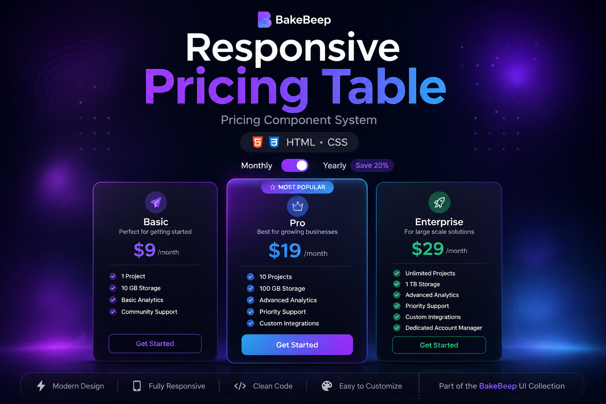
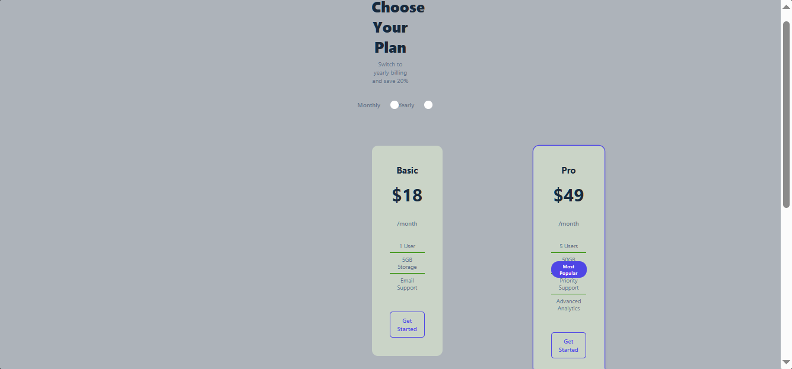
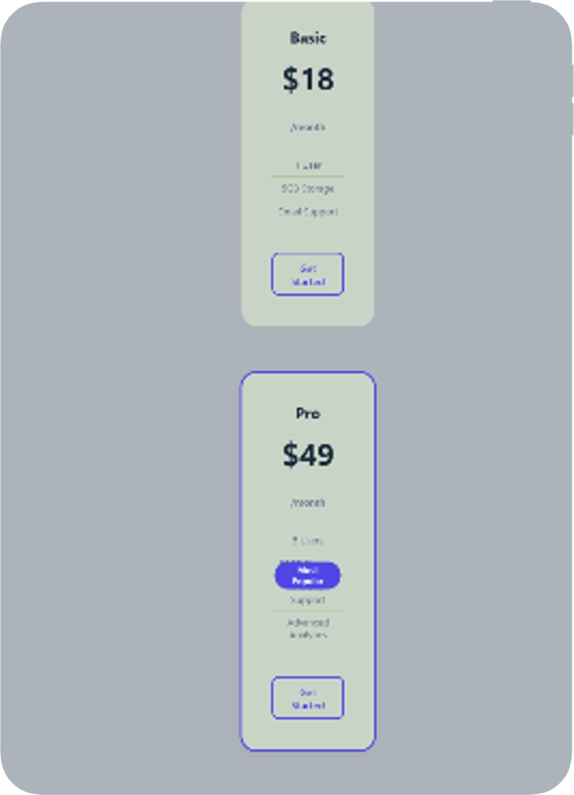

# Responsive Pricing Table

> A modern pricing comparison interface built with HTML and CSS.




> **BakeBeep UI Collection**

This project is part of the **BakeBeep UI Collection**—a growing library of modern, reusable interface components and frontend patterns designed with performance, accessibility, and maintainability in mind.

---

## Overview

Responsive Pricing Table is a production-inspired pricing interface that demonstrates how subscription plans can be presented clearly across desktop and mobile devices. The layout is built entirely with HTML and CSS and includes a pure CSS monthly/yearly billing toggle, responsive pricing cards, and a highlighted featured plan.

The project focuses on readability, comparison, and conversion-oriented layout principles commonly used on SaaS and product websites.

---

## Features

- Three pricing plans
- Featured "Most Popular" plan
- Pure CSS monthly/yearly billing toggle
- Responsive card layout
- Modern visual hierarchy
- Mobile-first responsive design
- Semantic HTML structure
- Reusable pricing card components

---

## Demo

🌐 **Live Demo:** (https://pricing-table-neon.vercel.app/)

### Animated Preview


### Desktop



### Mobile



---

## Design Philosophy

Pricing pages should help users compare options quickly and confidently. This interface emphasizes hierarchy, spacing, and plan differentiation while remaining clean and responsive across devices.

---

## Technologies

- HTML5
- CSS3
- CSS Grid
- Flexbox
- Custom Properties
- Media Queries
- CSS Checkbox Hack
- Data Attributes

---

## Folder Structure

```text
pricing-table/
│
├── assets/
├── css/
├── index.html
├── LICENSE
└── README.md
```

---

## Future Improvements

- Annual savings calculations
- Feature comparison table
- Currency switching
- Dark mode
- JavaScript billing logic
- React component version
- Tailwind CSS implementation

---

## License

MIT License.

---

## About BakeBeep

BakeBeep is a software studio building modern web interfaces, reusable UI systems, and developer-focused digital products.

Every repository reflects our commitment to clean engineering, thoughtful design, accessibility, and continuous improvement.

Explore the BakeBeep UI Collection to discover more frontend projects.